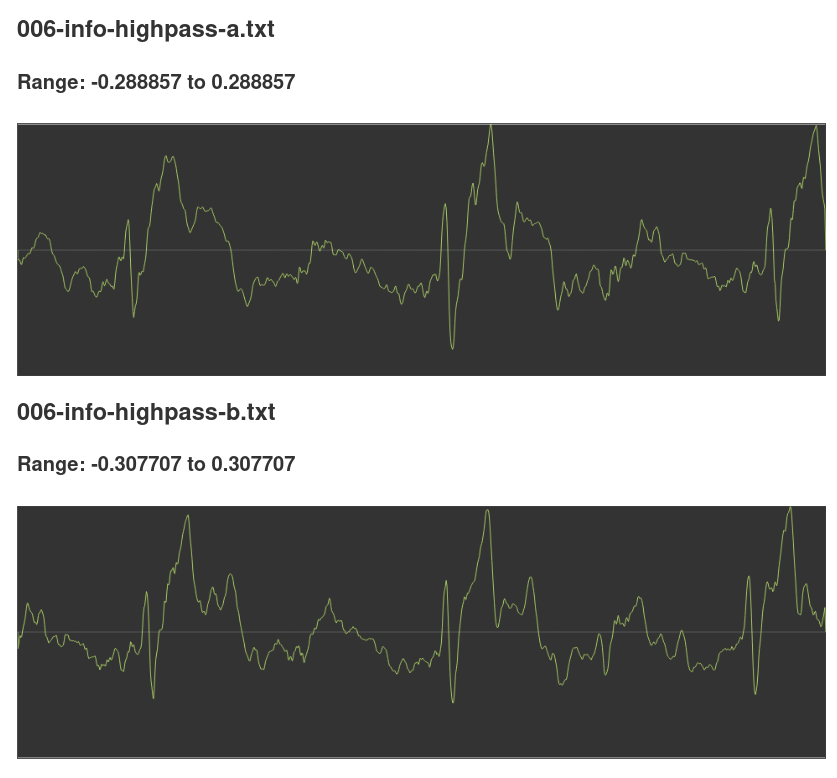

# graph-text-file

 A component or app that will render text files of newline-separated values as graphs, with user-zooming and -scaling support.

By "text files of newline-separated values as graphs," I mean text files with contents like:

  0.011850
  0.009820
  0.018803
  0.014631
  0.001678
  0.008657
  0.026670
  0.020141
  -0.004652
  -0.010753
  0.000538
  -0.000138
  -0.012191
  -0.017156
  -0.018455
  -0.021889
  -0.017632
  -0.010054
  -0.017461
  -0.032578
  -0.033557

…and so forth.

## Usage

### As app

- Clone this repo.
- `npm i` from the project directory.
- `make run` in the project directory.

The app will be running at http://localhost:7000

Or, if you don't want to run it locally, you can go to:

https://ghostcrab.io/graph-text-file

### As a component

    npm i graph-text-file

Then, in your code:

    import { graphArray } from 'graph-text-file';

    graphArray({
      id: 'unique-id',
      array: [0, 1, 0, -1],
      containerSelector: '#parent-div-id',
      onError: error => console.log(error),
      fitToParentWidth: true,
      zoomable: true, // Specify true if you want this function to set up d3-zoom on the graph so users can zoom and pan with the mouse and touch.
      yBounds: [-2, 2],
      maxMagToShow: 10, // Just don't graph values beyond 10 and -10; leave this out to graph them all.
    });
